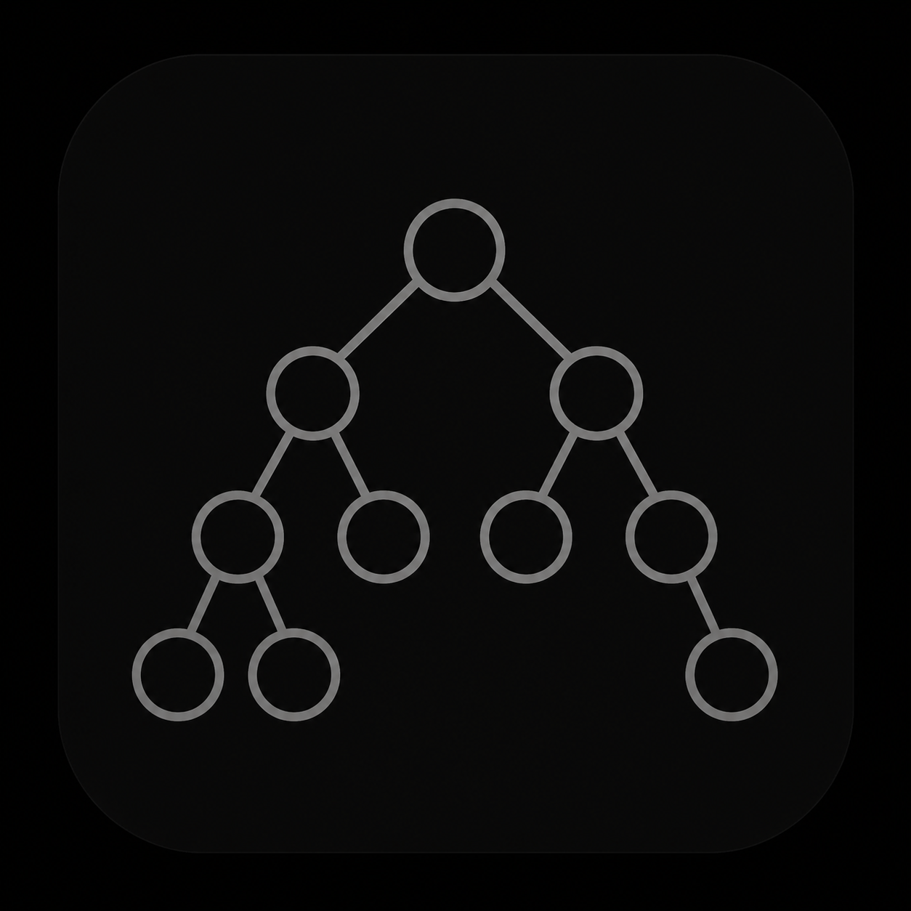
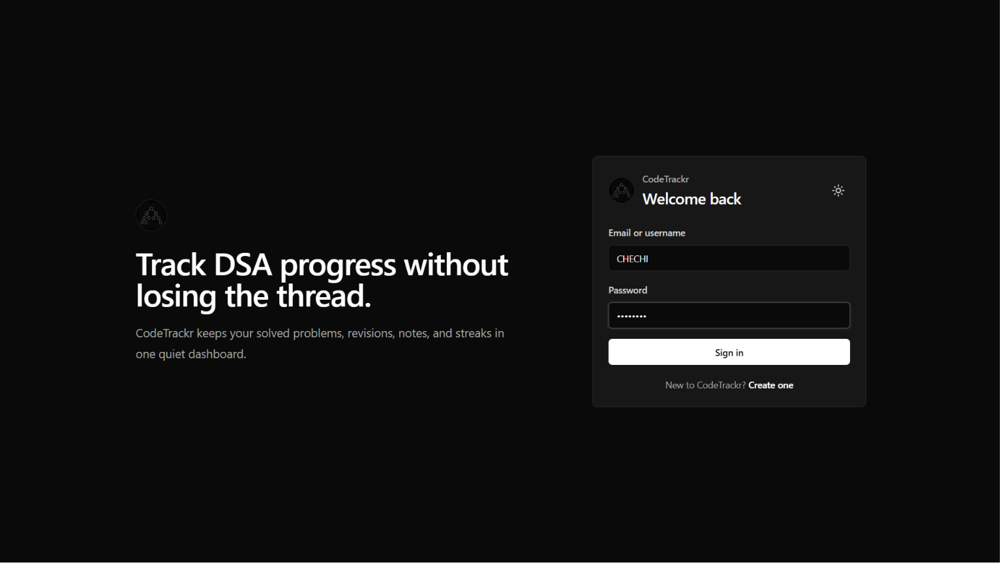
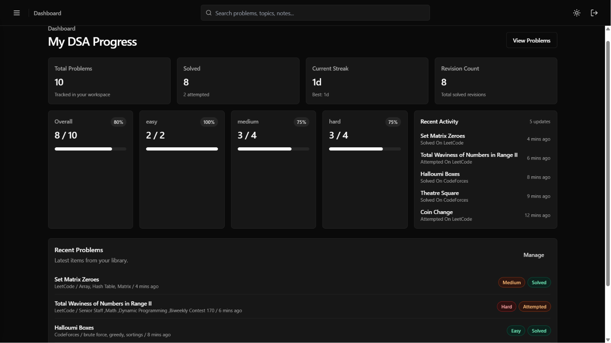
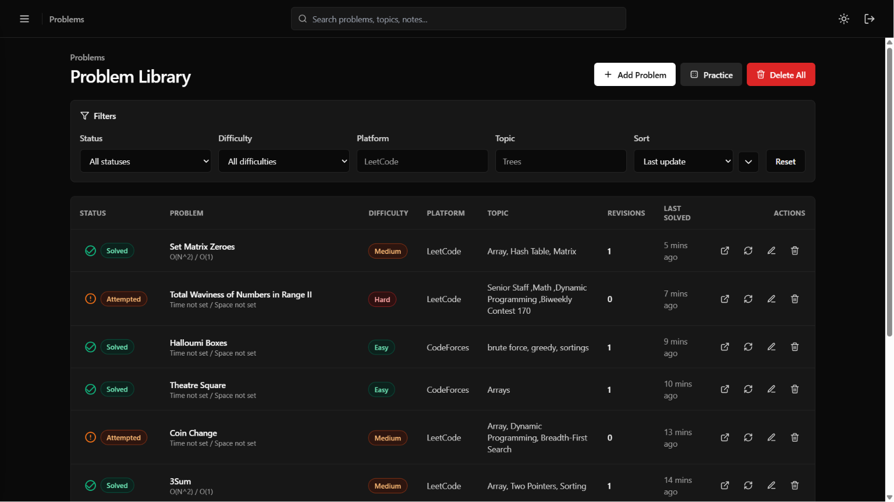
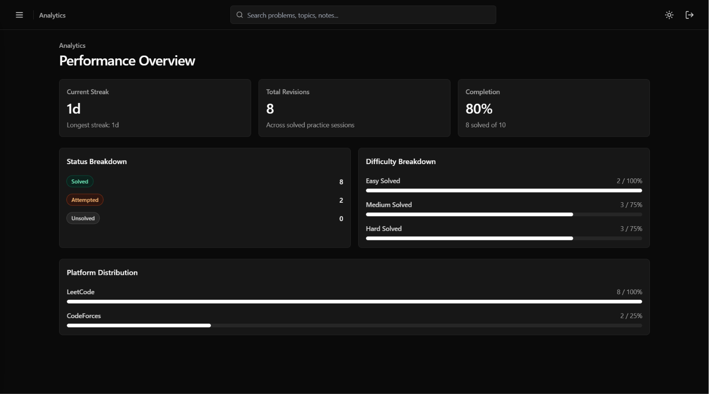
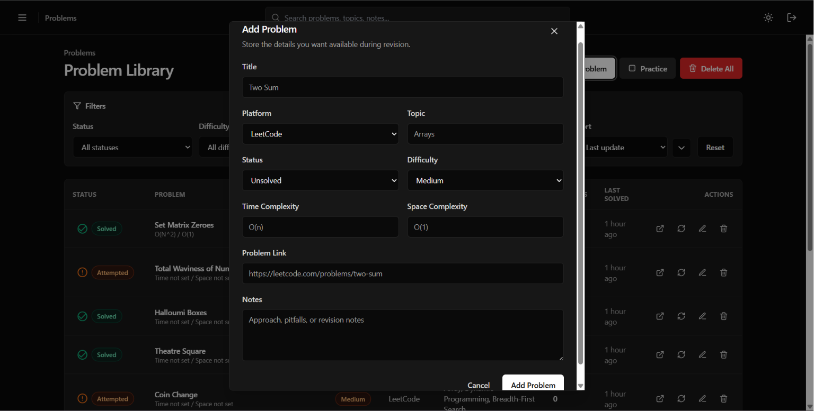
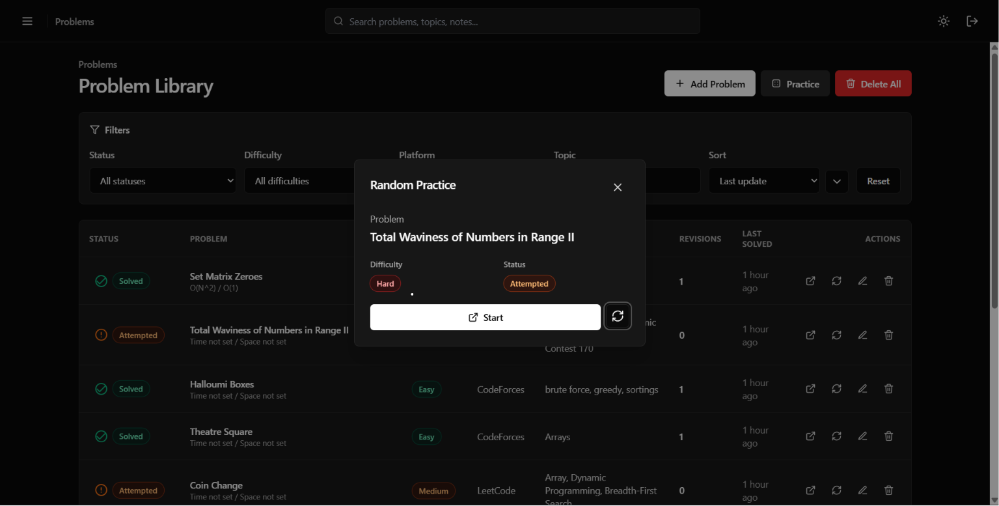

<p align="center">
  
</p>
<h1 align="center">CodeTrackr</h1>

<p align="center">
A modern full-stack coding interview tracker built with the MERN stack that helps developers organize coding problems, monitor progress, and stay consistent throughout interview preparation.
</p>

<p align="center">


</p>

<p align="center">
  <a href="https://code-trackr.vercel.app/">Live Demo</a>
  •
  <a href="https://codetrackr-sk34.onrender.com">Backend API</a>
  •
  <a href="https://github.com/CHECHI10/codeTrackr">Source Code</a>
</p>


<!-- GIF -->
# Product Tour

<p align="center">Watch a 45-second walkthrough of CodeTrackr. </p>

https://github.com/user-attachments/assets/3a24ef9d-78df-481f-a8a5-f5eb6c537dda

# About CodeTrackr

Preparing for coding interviews often means switching between multiple tools for tracking solved problems, taking notes, monitoring progress, and planning revisions.

**CodeTrackr** brings everything together into one modern web application.

It enables developers to organize coding problems, visualize progress through interactive analytics, maintain revision notes, and stay consistent using features like streak tracking, filtering, random problem selection, and performance insights.

The project was designed with scalability, clean architecture, and user experience in mind while following modern full-stack development practices.

> [!TIP]
> **CodeTrackr isn't just a CRUD application.** It focuses on solving a real problem by providing developers with a centralized workspace to manage coding interview preparation, monitor progress, and stay consistent through analytics and productivity features.

#  Highlights

-  Secure JWT Authentication using HTTP-only Cookies
-  Interactive Analytics Dashboard
-  Coding Progress Tracking
-  Daily Streak Tracking
-  Random Problem Generator
-  Revision Notes
-  Search, Filter & Sorting
-  Fully Responsive Design
-  Dark & Light Theme


#  Features

## Authentication & Security

- User Registration & Login
- JWT Authentication
- HTTP-only Cookie Sessions
- Protected Routes
- Secure Logout

---

## Problem Management

- Add Coding Problems
- Edit Existing Problems
- Delete Problems
- Bulk Delete Support
- Difficulty Levels
- Topic Categorization
- Platform Tracking
- Personal Notes
- Revision Scheduling

---

##  Dashboard & Analytics

- Overall Progress Dashboard
- Difficulty Distribution
- Platform-wise Statistics
- Solved Problems Overview
- Daily Streak Counter
- Recent Activity
- Completion Insights

---

##  Productivity Features

- Random Problem Picker
- Advanced Search
- Multiple Filters
- Sorting Options
- Pagination
- Responsive Dashboard

---

##  User Experience

- Dark / Light Theme
- Modern UI
- Toast Notifications
- Keyboard Shortcuts

# Tech Stack

| Category | Technologies |
|-----------|--------------|
| Frontend | React, Vite, Tailwind CSS |
| Backend | Node.js, Express.js |
| Database | MongoDB, Mongoose |
| Authentication | JWT, HTTP-only Cookies |
| Charts | Recharts |
| State Management | React Context API |
| API Communication | Axios |
| Deployment | Vercel, Render |
| Version Control | Git, GitHub |

#  Project Structure

```text
CodeTrackr
│
├── client/
│   ├── public/
│   ├── src/
│   │   ├── assets/
│   │   ├── components/
│   │   ├── context/
│   │   ├── hooks/
│   │   ├── layouts/
│   │   ├── pages/
│   │   ├── services/
│   │   ├── utils/
│   │   └── App.jsx
│   └── package.json
│
├── server/
│   ├── config/
│   ├── controllers/
│   ├── middleware/
│   ├── models/
│   ├── routes/
│   ├── services/
│   ├── utils/
│   └── server.js
│
└── README.md
```

#  System Architecture

```text
                        +----------------------+
                        |      Web Browser     |
                        +----------+-----------+
                                   |
                                   |
                                   ▼
                        +----------------------+
                        |   React + Vite App   |
                        +----------+-----------+
                                   |
                          Axios HTTP Requests
                                   |
                                   ▼
                        +----------------------+
                        |  Express REST API    |
                        +----------+-----------+
                                   |
              +--------------------+--------------------+
              |                    |                    |
              ▼                    ▼                    ▼
      Authentication        Controllers          Middleware
         (JWT)              Business Logic     Validation/Auth
              |                    |                    |
              +--------------------+--------------------+
                                   |
                                   ▼
                        +----------------------+
                        |      MongoDB         |
                        |   (Mongoose ODM)     |
                        +----------------------+
```

#  Authentication Flow

```text
User Login
     │
     ▼
Credentials Sent to Backend
     │
     ▼
Credentials Verified
     │
     ▼
JWT Token Generated
     │
     ▼
HTTP-only Cookie Created
     │
     ▼
Browser Stores Cookie Securely
     │
     ▼
Protected Requests Include Cookie
     │
     ▼
Authentication Middleware
     │
     ▼
Access Granted
```


#  Database Design

```text
┌────────────────────────────┐
│            User            │
├────────────────────────────┤
│ _id                        │
│ name                       │
│ email                      │
│ password                   │
│ streak                     │
│ preferences                │
└──────────────┬─────────────┘
               │
               │ One-to-Many
               ▼
┌────────────────────────────┐
│          Problem           │
├────────────────────────────┤
│ _id                        │
│ title                      │
│ difficulty                 │
│ platform                   │
│ topic                      │
│ status                     │
│ notes                      │
│ revisionDate               │
│ createdBy                  │
└────────────────────────────┘
```
## Screenshots

<table>
<tr>
<td align="center">
<br>
<b>Login</b>
</td>
<td align="center">
<br>
<b>Dashboard</b>
</td>
</tr>

<tr>
<td align="center">
<br>
<b>Problems</b>
</td>
<td align="center">
<br>
<b>Analytics</b>
</td>
</tr>
<tr>
<td align="center">
<br>
<b>Add Problem</b>
</td>
<td align="center">
<br>
<b>Random Problem</b>
</td>
</tr>
</table>


# REST API Overview

| Method | Endpoint | Description |
|---------|----------|-------------|
| POST | `/api/auth/register` | Register a new user |
| POST | `/api/auth/login` | Login user |
| POST | `/api/auth/logout` | Logout user |
| GET | `/api/auth/me` | Get authenticated user |
| GET | `/api/problems` | Fetch all problems |
| POST | `/api/problems` | Add a new problem |
| PUT | `/api/problems/:id` | Update a problem |
| DELETE | `/api/problems/:id` | Delete a problem |
| GET | `/api/dashboard` | Dashboard statistics |
| GET | `/api/analytics` | Analytics data |

# Deployment Architecture

```text
                User
                  │
                  ▼
        Vercel (React Frontend)
                  │
          HTTPS API Requests
                  │
                  ▼
       Render (Express Backend)
                  │
                  ▼
         MongoDB Atlas Database
```

### Deployment Stack

| Service | Platform |
|----------|----------|
| Frontend | Vercel |
| Backend | Render |
| Database | MongoDB Atlas |

## Installation

### Clone the repository

```bash
git clone https://github.com/CHECHI10/codeTrackr
cd codeTrackr
```

---

### Backend Setup

```bash
cd backend
npm install
npm run dev
```

The backend server will start on the configured port (default: `3000`).

---

### Frontend Setup

Open a new terminal.

```bash
cd frontend
npm install
npm run dev
```

The frontend will start on the configured Vite development server.

---

### Running the Application

Start both services in separate terminals:

| Service | Command |
|---------|---------|
| Backend | `cd backend && npm run dev` |
| Frontend | `cd frontend && npm run dev` |

Once both services are running, open the frontend in your browser to access SoundSphere.


#  Environment Variables

### Backend (`server/.env`)

```env
PORT=3000

MONGO_URI=<your_mongodb_connection_string>

JWT_SECRET=<your_jwt_secret>

CLIENT_ORIGIN=http://localhost:5173

NODE_ENV= development
```

### Frontend (`client/.env`)

```env
VITE_API_URL=http://localhost:3000/api
```

# Performance Optimizations

- Component-based architecture for better reusability
- Efficient state management using React Context
- Protected routes with middleware-based authentication
- Secure HTTP-only cookie authentication
- Environment-specific API configuration
- Optimized MongoDB queries using Mongoose
- Responsive layouts for desktop, tablet, and mobile devices
- Lazy loading where applicable

# Challenges Faced

Building CodeTrackr involved solving several real-world engineering challenges beyond implementing core features.

### Production Authentication

Configuring JWT authentication using HTTP-only cookies across different origins required careful handling of cookie attributes, CORS policies, and secure settings to ensure authentication worked consistently in both development and production environments.

---

### Cross-Origin Requests

Since the frontend and backend are deployed on different platforms, configuring CORS correctly while maintaining security required multiple iterations of debugging and testing.

---

### Protected Routing

Maintaining authenticated user sessions across page refreshes without exposing sensitive information required designing middleware-based authorization and persistent session validation.

---

### State Synchronization

Keeping dashboard statistics, analytics, and problem lists synchronized after CRUD operations required careful frontend state management to avoid unnecessary API requests while ensuring data consistency.

---

### Deployment Debugging

Deploying a full-stack MERN application introduced several production-specific issues involving environment variables, API endpoints, cookies, and hosting platform configurations that differed from local development.

# What I Learned

Building CodeTrackr strengthened both my frontend and backend development skills.

Some of the key takeaways include:

- Designing scalable REST APIs using Express.js
- Implementing secure authentication with JWT and HTTP-only cookies
- Structuring a production-style MERN application
- Managing application state effectively in React
- Designing reusable UI components
- Debugging cross-origin authentication issues
- Deploying full-stack applications using Vercel and Render
- Organizing code for maintainability and scalability

Building CodeTrackr strengthened both my frontend and backend development skills.

Some of the key takeaways include:

- Designing scalable REST APIs using Express.js
- Implementing secure authentication with JWT and HTTP-only cookies
- Structuring a production-style MERN application
- Managing application state effectively in React
- Designing reusable UI components
- Debugging cross-origin authentication issues
- Deploying full-stack applications using Vercel and Render
- Organizing code for maintainability and scalability

#  Future Improvements

Some features planned for future releases include:

- Email verification
- Password reset functionality
- Social authentication (Google/GitHub)
- Problem sharing between users
- Custom coding sheets
- Contest tracking
- Calendar-based revision planner
- Achievement badges
- Progressive Web App (PWA)
- Mobile application

# Contributing

Contributions, issues, and feature requests are always welcome.

If you'd like to improve CodeTrackr:

1. Fork the repository
2. Create a feature branch
3. Commit your changes
4. Push the branch
5. Open a Pull Request

Constructive feedback is always appreciated.

## License

This project is licensed under the MIT License. See the `LICENSE` file for more information.

## Contact

**Developer:** Rohit Choudhary

GitHub: https://github.com/CHECHI10

LinkedIn: https://www.linkedin.com/in/rohit-choudhary01

Email: <rohitchechi10@gmail.com>